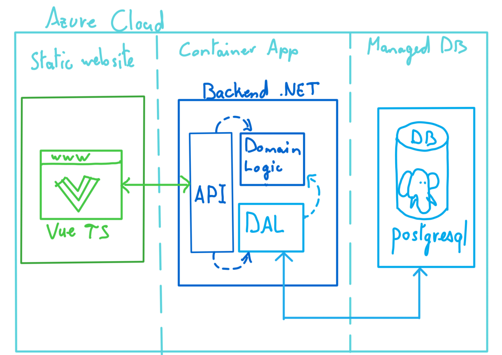

# MonHundle 🎮🐉
Monhundle is a personal project within the Monster Hunter (MonHun) licence. The system will randomly pick a monster within the game roaster and the player will have to guess which monster based on the feedback after each guess.

The project was built up from scratch, with the help of AIs to explain concepts I was unfamiliar with (notably devops and some frontend styling)

---

## 📌 Summary
- [Architecture](#🏗️-architecture)
- [Roadmap](#🗺️-roadmap)
- [Acknowledgements](#🙏-Acknowledgements)

## 🏗️ Architecture
### Diagram

### Tech Stack
| Component      | Technology                    |
|------------------|---------------------------------|
| **Frontend**     | Vue.js 3 + Vite                 |
| **Backend**      | .NET 8 + Entity Framework Core  |
| **Base de données** | PostgreSQL 15 (Azure Database) |
| **Infrastructure** | Docker + Azure Cloud Services  |

## Technical choices 
- **Vue.js** : I chose Vue notably because I had some experience with it that I considered outdated. This was an opportunity to refresh my knowledge while strengthening my frontend skills.
- **.NET 8** : I always wanted to work with C# without getting the opportunity to do so. This project was my way to build up experience with the langauge while transitioning  from Java. I chose version 8 because it is popular and requested within the industry.
- **PostgreSQL** : The choice was mostly motivated by the popularity of the technology and the lower cost of entry.
- **Azure Container Apps** : While I could have chosen AWS or GCP, Azure integrates well with C# .NET applications, and is commonly used in the industry. 

# 🗺️ Roadmap & Future plans
Here are some improvements I want to bring in a nearer future (in no special order)
* Making the web page responsive for smaller screens
* Making the interface prettier and more inline with game aesthetics
* Adding monsters from more Monster Hunter games (MH1 to MH Sunbreak, only mainline games)
* Sharing option to copy results in the clip board
* Adding a caching layer between the backend and the database to spare database transactions
* Building a decent statistical tracking of the game played
* Adding a Daily puzzle mode
* Allowing the player to reduce the pool of monster to games they played for "unlimited" plays
* Support more languages

## Other future plans
If the motivation is still there when the web version is in a good place, here are some ideas to extend the application
* Building a mobile application of the game, playable offline, but sending game data when online
* Building a Twitch integration
*
* Have some "progression" system with unlockable

# 🙏 Acknowledgements

This project has been made with love and by passion for the Monster Hunter games, but also to improve my software engineering skills. 

Generative AI (OpenAI's *ChatGPT* and Mistral's *LeChat*) have been used mostly to explain concept, patterns and techniques (especially on devops aspect), but also to generate scripts and simple codes. 

Monsters icons from Monster Hunter Wilds were made by [Gaudium017](https://x.com/Gaudium017).

I want to extend a huge thank you to my friends and family who supported and helped me throughout this project.

## Disclaimers

This application is a unofficial fan-project and is not related in any shape or form to Capcom Entertainment Inc. or its affiliates. Monster Hunter is a property of Capcom. 